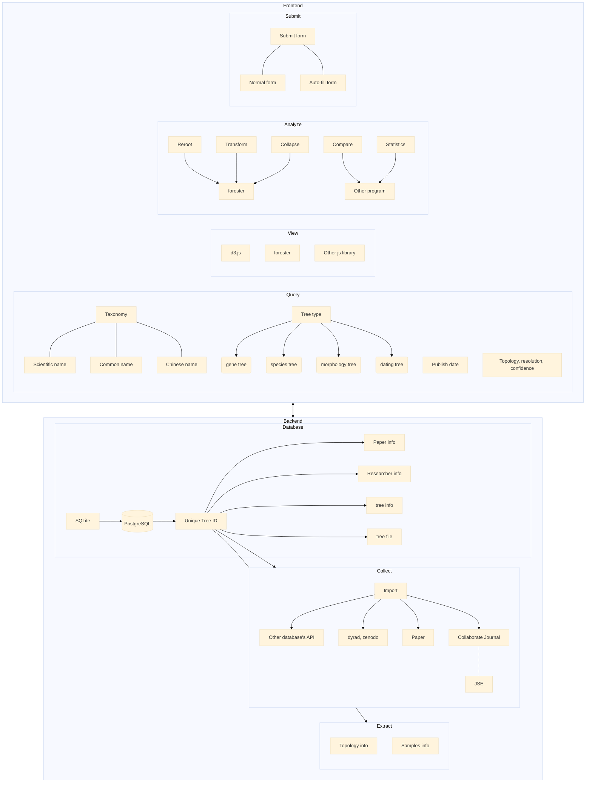

# plant_tree_db
Plant phylogenetic tree database

植物系统发育树数据库

# Structure

```mermaid
%%{init: {'theme': 'base'}}%%
flowchart TB
    subgraph Frontend
        subgraph Query
            q1[Taxonomy]
            q1 --- qq1[Scientific name]
            q1 --- qq2[Common name]
            q1 --- qq3[Chinese name]
            q2[Publish date]
            q3[Tree type]
            q3 --> t1(gene tree)
            q3 --> t2(species tree)
            q3 --> t3(morphology tree)
            q3 --> t4(dating tree)
            q4[Topology, resolution, confidence]
        end
        subgraph View
            v1[d3.js]
            v2[forester]
            v3[Other js library]

        end
        subgraph Analyze
            Reroot --> forester
            Transform --> forester
            Collapse --> forester
            Compare --> a1[Other program]
            Statistics --> a1
        end
        subgraph Submit
            s0[Submit form] --- sf1[Normal form]
            s0[Submit form] --- sf2[Auto-fill form]
        end
    end
    subgraph Backend
        subgraph Collect
            Import --> s1[Other database's API]
            Import --> s2[dyrad, zenodo]
            Import --> s3[Paper]
            Import --> s4[Collaborate Journal] -.- JSE
        end
        subgraph Extract
            e1[Topology info]
            e2[Samples info]
        end
        subgraph Database
            d1 --> d2[Paper info]
            d1 --> d3[Researcher info]
            d1 --> d4[tree info]
            d1 --> d5[tree file]
            SQLite --> db1[(PostgreSQL)]
            db1 --> d1[Unique Tree ID]
        end
        d1 --> Collect
        d1 --> Extract
    end
Frontend <--> Backend 
```