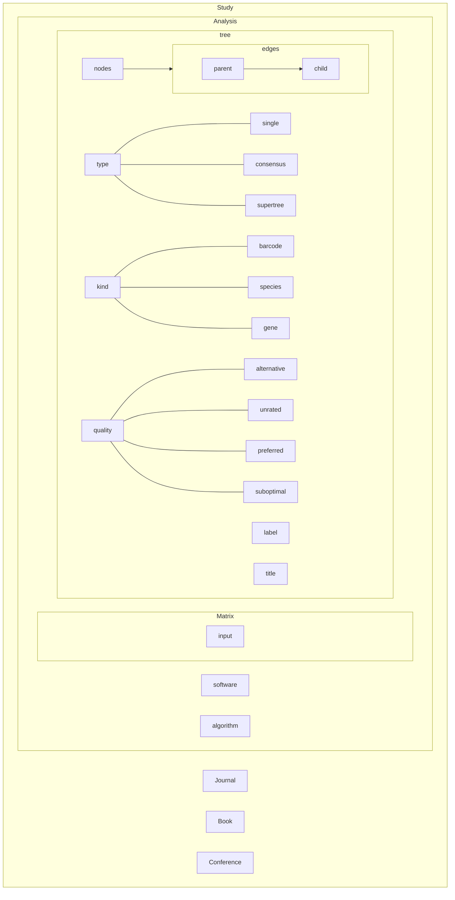
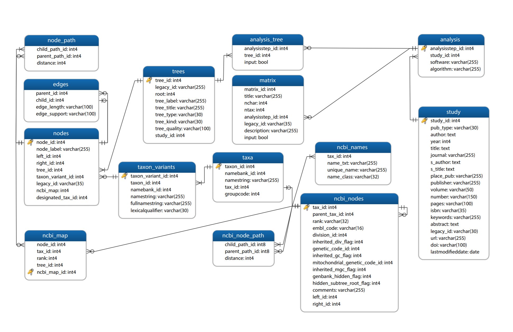
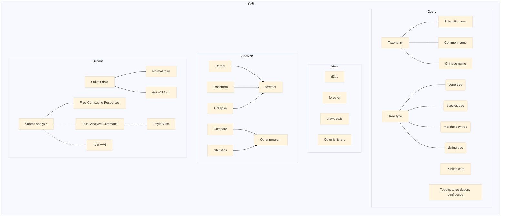
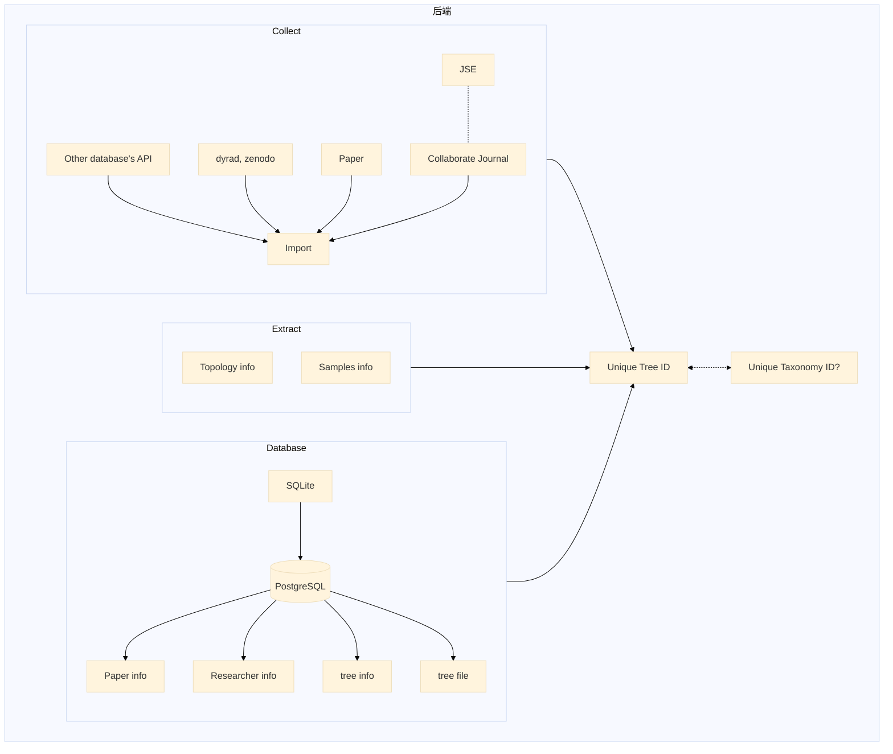

# plant_tree_db
Plant phylogenetic tree database

植物系统发育树数据库

# Compare
## TreeBase:
> "TreeBASE is a repository of phylogenetic information, specifically user-submitted phylogenetic trees **and the data used to generate them**. "

> "TreeBASE accepts **all kinds of phylogenetic data** (e.g., trees of species, trees of populations, trees of genes) representing all biotic taxa"

> "Data used in publications that are in preparation or in review can be submitted to TreeBASE but will not be available to the public until they have passed peer review. "

> "As of April 2014, TreeBASE contains data for 4,076 publications written by 8,777 different authors. These studies analyzed 8,233 matrices and resulted in 12,817 trees with 761,460 taxon labels that mapped to 104,593 distinct taxa."

### Features
- Richer annotation of metadata (journal DOIs, specimen georeferences, Genbank accession numbers, etc)

-  A mapping between taxon labels and taxonomic names in uBio and NCBI for improved normalization of names

- The ability to visualize and edit trees using Phylowidget

- The ability to search on tree topology

- Persistent and resolvable URIs for data objects in TreeBASE (i.e. studies, trees, matrices) serve as both globally unique identification numbers and resource locators. These can be included in articles and on researcher's websites, making access to TreeBASE data only a click away

- Data are delivered in several serializations, including NEXUS and NeXML

- A special URL gives journal editors and reviewers anonymous advanced access to data

- Programmatic access to the data using the PhyloWS API.

### Database

## Open tree of life: 
> "Finally, TreeBASE, supplemented with data from Dryad served as the core source of data for Open Tree of Life"

>"Up to summer 2015, the release cycle has been months between new versions of the synthetic tree, but this should shorten in the future. "

> drawtree.js (FreeBSD license)

### Features
- 将已发表的树合成为一个大树, [Progress](https://tree.opentreeoflife.org/about/progress)显示已整合87740OTU，还有3855030未整合。
- 数据可下载，为json，使用专有OTT的ID，
- OTT为整合多个分类信息来源的taxonomy系统，包括NCIB, GBIF

# Structure

